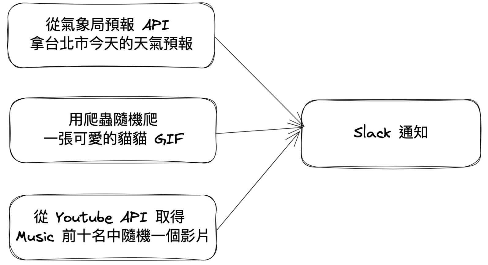

# Airflow Demo



### Requirements
1. 取得各 API 授權
    * [Get Youtube Data API Key](https://hackmd.io/@c36ICNyhQE6-iTXKxoIocg/S1eYdtA1P#%E5%8F%96%E5%BE%97-Youtube-API_KEY)
    * [Get 中央氣象局 API Authorizatio](https://ithelp.ithome.com.tw/articles/10243411)
    * [Get Slack token & channel ID](https://blog.crazyfan.net/posts/2017/04/08/slack_incoming_webhooks/)
2. 建立 `config.py`
    ```python
    WEATHER_API_AUTHORIZATION = "{FILL HERE}"
    YOUTUBE_API_KEY = "{FILL HERE}"
    SLACK_TOKEN = "{FILL HERE}"
    SLACK_CHANNEL_ID = "{FILL HERE}"
    ```

### Run Airflow using Sequential Executor
```bash
docker build . -f Dockerfile.SequentialExecutor --tag airflow:sequential-executor --no-cache
docker run -p 8080:8080 -it airflow:sequential-executor
```

### Run Airflow using Local Executor
```bash
docker compose -f docker-compose-local-executor.yml up
```

### Run Airflow using Celery Executor
```bash
docker build . -f Dockerfile --tag airflow-main --no-cache
docker network create -d bridge airflow-network
docker compose -f docker-compose-celery-executor.yml up airflow-postgres airflow-redis
docker compose -f docker-compose-celery-executor.yml up airflow-init
docker compose -f docker-compose-celery-executor.yml up airflow-webserver airflow-scheduler
docker compose -f docker-compose-celery-executor.yml up airflow-worker-1 airflow-worker-2 airflow-worker-3
```