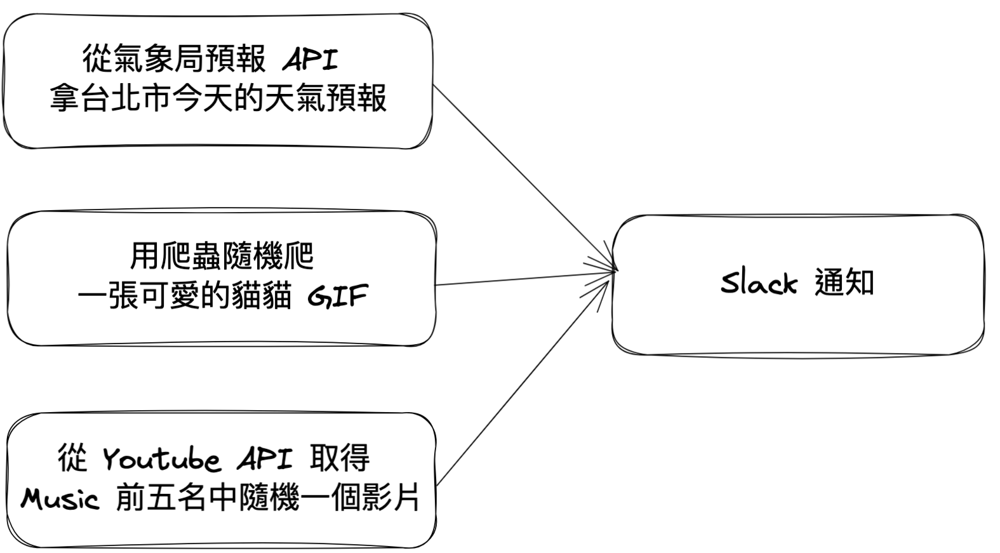

# Airflow Tutorial
> Python version >= 3.7

1. Install
    ```
    pip install apache-airflow
    pip install -r requirements.txt
    ```

2. Initialize the database
    ```
    airflow db init
    ```

3. 調整 `~/airflow/airflow.cfg`
    * **`dags_folder`**: 你 DAG py file 的資料夾路徑
    * **`default_timezone`**: 時區

    * **`executor`**: executor type (default: `SequentialExecutor`)
    * **`sql_alchemy_conn`**: metadata database (default: `sqlite:////home/airflow/airflow.db`)
    * (*For celery executor*)
        * **`broker_url`** (redis / RabbitMQ)
        * **`result_backend`** (MySQL / PostgreSQL)

4. 建立使用者 
    ```
    airflow users create -e {EMAIL} -f {FIRST_NAME} -l {LAST_NAME} -p {PASSWORD} -u {USER_NAME} -r {ROLE: Admin/...}
    ```

5. 啟動 scheduler
    ```
    # export OBJC_DISABLE_INITIALIZE_FORK_SAFETY=YES
    airflow scheduler -D
    ```

6. 啟動 web server (default: `0.0.0.0:8080`)
    ```
    airflow webserver -H 127.0.0.1
    ```

7. 進入 `127.0.0.1:8080`
    

    * 點擊 slack-notification-daily
        

* (*For celery executor*) 在 worker node 上啟動 worker
    ```
    airflow celery worker
    ```

# Airflow Demo



### Requirements
1. Install Docker
2. 取得各 API 授權
    * [Get Youtube Data API Key](https://hackmd.io/@c36ICNyhQE6-iTXKxoIocg/S1eYdtA1P#%E5%8F%96%E5%BE%97-Youtube-API_KEY) \
        (取得 Youtube API_KEY 就行)
    * [Get 中央氣象局 API Authorization](https://ithelp.ithome.com.tw/articles/10243411)
    * [Get Slack token & channel ID](https://hackmd.io/@sideex/slack-zh) \
        (channel ID: 看你想要在哪個 channel 收到通知)
3. 建立 `config.py`
    ```python
    WEATHER_API_AUTHORIZATION = "{FILL HERE}"
    YOUTUBE_API_KEY = "{FILL HERE}"
    SLACK_TOKEN = "{FILL HERE}"
    SLACK_CHANNEL_ID = "{FILL HERE}"
    ```
4. 測試 `python3 main.py` 是否能成功執行

### Run Airflow using Sequential Executor
```bash
docker compose -f docker-compose-sequential-executor.yml up
```


### Run Airflow using Local Executor
```bash
docker compose -f docker-compose-local-executor.yml up
```


### Run Airflow using Celery Executor
```bash
docker build . -f Dockerfile --tag airflow-main --no-cache
docker network create -d bridge airflow-network
docker compose -f docker-compose-celery-executor.yml up airflow-postgres airflow-redis
docker compose -f docker-compose-celery-executor.yml up airflow-init
docker compose -f docker-compose-celery-executor.yml up airflow-webserver airflow-scheduler airflow-worker-1 airflow-worker-2 airflow-worker-3
```


* 到 Browse > Task Instance


> web server
> * url: `127.0.0.1:8080`
> * user name: jojo
> * password: jojo
